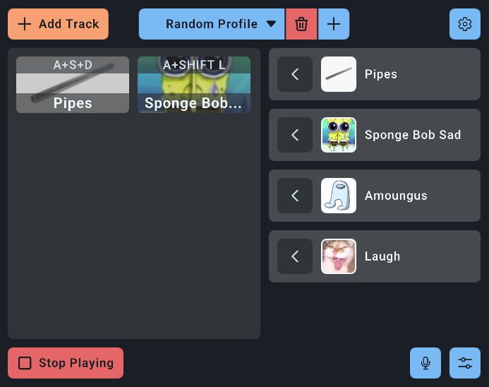
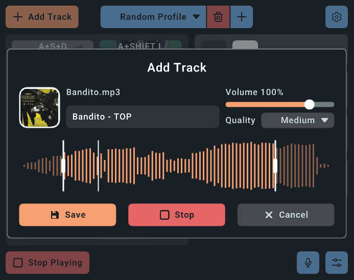
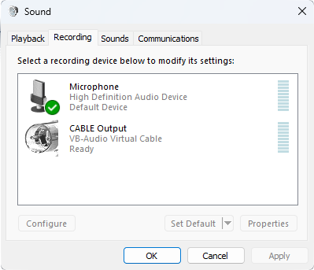
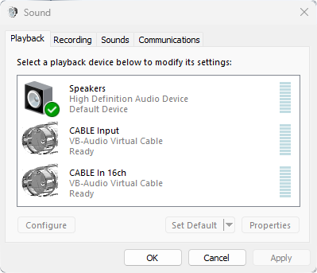

# Soundpad

<p align="center">
    
    
</p>

A soundboard (made with [go-rlgui](https://github.com/MarcosTypeAP/go-rlgui) ツ) that mixes played tracks and your real microphone into a virtual microphone, so people in voice calls hear both your voice and your sounds together. You can also enable a monitor output to hear the played tracks locally.

> Pre-built binaries are available on the [Releases](https://github.com/MarcosTypeAP/soundpad/releases) page.

---

## Installation

This program **DOES NOT** require installation, as it is a single statically compiled binary, you can just run it. But if you really want to install it:

### Linux

```sh
# Global installation:
PREFIX=/usr/local
# Or
# Local installation:
PREFIX=~/.local

# Copy the program binary
$ cp <soundpad-path> $PREFIX/bin/

# Copy the .desktop file
$ cp assets/soundpad.desktop $PREFIX/share/applications

# Copy the program icon
$ mkdir -p $PREFIX/share/icons/hicolor/256x256/apps
$ cp assets/icons/soundpad.png $PREFIX/share/icons/hicolor/256x256/apps
```

### Windows

Steps:

1. Create the `Soundpad` directory at `C:\Program Files\`.
2. Copy the `Soundpad.exe` to `C:\Program Files\Soundpad\`.
3. Right-click `C:\Program Files\Soundpad\Soundpad.exe` → Create shortcut, then move the shortcut to your Desktop or Start Menu (`%APPDATA%\Microsoft\Windows\Start Menu\Programs\`)

## Usage

In your communication app (Discord, TeamSpeak, etc.), set your microphone input to `Soundpad` (or similar) on **Linux** or `CABLE Output` on **Windows** (see [Platform notes](#platform-notes)). That's it — your voice and any playing sounds will come through that single device, mixed together.

### Volume gain controls

- `Microphone`: Refers to the selected input device that mixes with the played tracks.
- `Tracks`: Global volume for all tracks (virtual microphone and monitor).
- `Monitor`: Refers to the selected output device that mirrors the played tracks.

## Some Features

- Global keyboard shortcuts (up to 4-key combos)
- Creating of profiles so you can have different layouts for different situations
- Multiple sounds playing simultaneously, with a hotkey to clear them all
- Fine volume gain control
- Supports most common media formats
- Audio wave cutter, saving to **MP3**, and loading to `Low` (8bit), `Medium` (16bit), or `High` (32bit) quality to control RAM usage
- Paste a PNG/JPG by right-clicking any "Add/Change Image" button
- Noise suppression passthrough — your real mic goes through [RNNoise](https://github.com/xiph/rnnoise) before being forwarded to the virtual mic

> Just a note: You can right-click things to display option menus.

## Platform notes

**Linux** — Virtual mic is created automatically via PulseAudio. The app requires X11 or XWayland.

> Wayland will not be supported until it gets a standardized way of handling global shortcuts.

**Windows** — Requires the [VB-CABLE](https://vb-audio.com/Cable) virtual audio driver to be installed for the virtual microphone to work.

> At the moment of writing this, there is not way of creating virtual audio sources in Windows natively.

## Dependencies

**Linux:**
- `pulseaudio`/`pipewire-pulse` — general audio
- `pactl` (`pulseaudio-utils`) — virtual microphone setup
- `zenity` — file picker dialog
- `libX11` and `libXi` — global hotkey listening
- `bluetoothctl` (`bluez`) — optional, used to resolve friendly names for Bluetooth devices
- `xclip` (X11) / `wl-clipboard` (Wayland) - optional, used to read images from the clipboard

> The core dependencies are probably already installed on your system.

### Debian-based Systems

```sh
# Required
$ apt install -y --no-install-recommends libxi6 libx11-6 pulseaudio-utils zenity

# Optional
# - X11
$ apt install -y --no-install-recommends bluez xclip
# - Wayland
$ apt install -y --no-install-recommends bluez wl-clipboard
```

**Windows:**
- [VB-CABLE Driver](https://vb-audio.com/Cable)

> After restarting, to check if the installation was successful, make sure these new devices have been added: 
>
> <p>
>    
>    
> </p>

## Building from source

The build uses CGO and statically links PortAudio and RNNoise. The Makefile handles fetching those dependencies automatically.

### Dependencies

- `build-essential`, `autoconf`, and `libtool` — used to build the project
- `nasm` - used to compile ffmpeg with hand-optimized assembly
- `gcc-mingw-w64` — optional, used to cross-compile to windows

#### Debian-based Systems

```sh
# For building the project
$ apt install -y --no-install-recommends autoconf libtool libpulse-dev nasm

# For cross-compiling to Windows
$ apt install -y --no-install-recommends gcc-mingw-w64-x86-64
```

### Building

```sh
# Output binary lands in `build/`.
mkdir -p build

# Install Go dependencies
go mod tidy

# Linux
make linux-release

# Windows (cross-compile from Linux, requires mingw-w64)
make windows-release
```

For a dev build with pprof on `localhost:6969` and the GUI debug overlay:

```sh
make linux-dev
```

### Building from Windows

Idk bro, use [WSL](https://learn.microsoft.com/en-us/windows/wsl/install) or adapt the Makefile, you figure it out. Next time, think twice before choosing an OS.

> [Here](https://cdimage.debian.org/debian-cd/current/amd64/iso-cd/debian-13.4.0-amd64-netinst.iso) is the ISO for debian 13 btw ツ.

## GUI

The entire UI is built on [go-rlgui](https://github.com/MarcosTypeAP/go-rlgui), a semi-retained-mode GUI library I wrote for this project on top of [raylib-go](https://github.com/gen2brain/raylib-go). It handles CSS flexbox layout, sub-windows, text, sliders, input, etc.

## License

The [third-party licenses](THIRD_PARTY_LICENSES) are embedded in the release binaries and shown in the app going to `Settings (icon) -> Licenses`.
